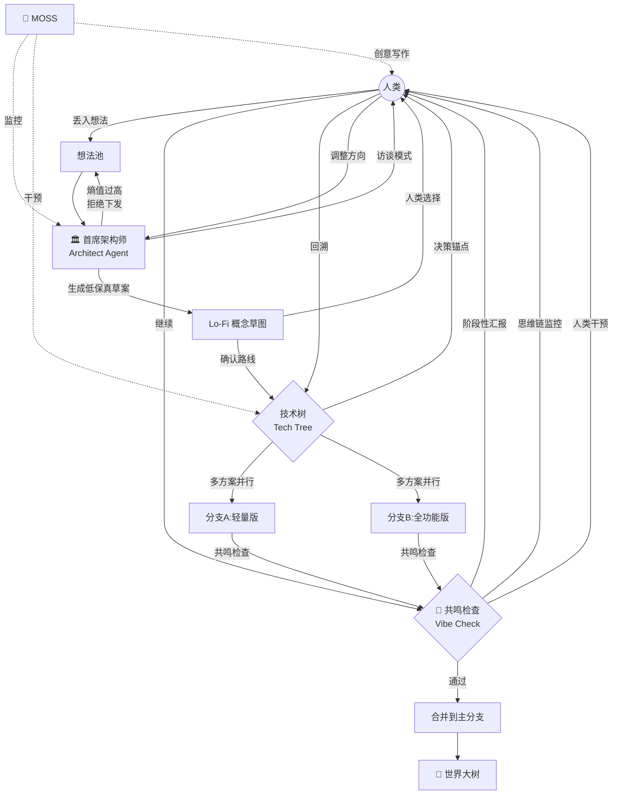
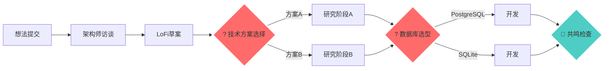
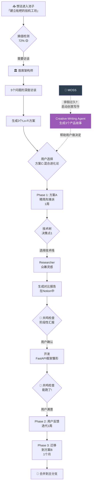
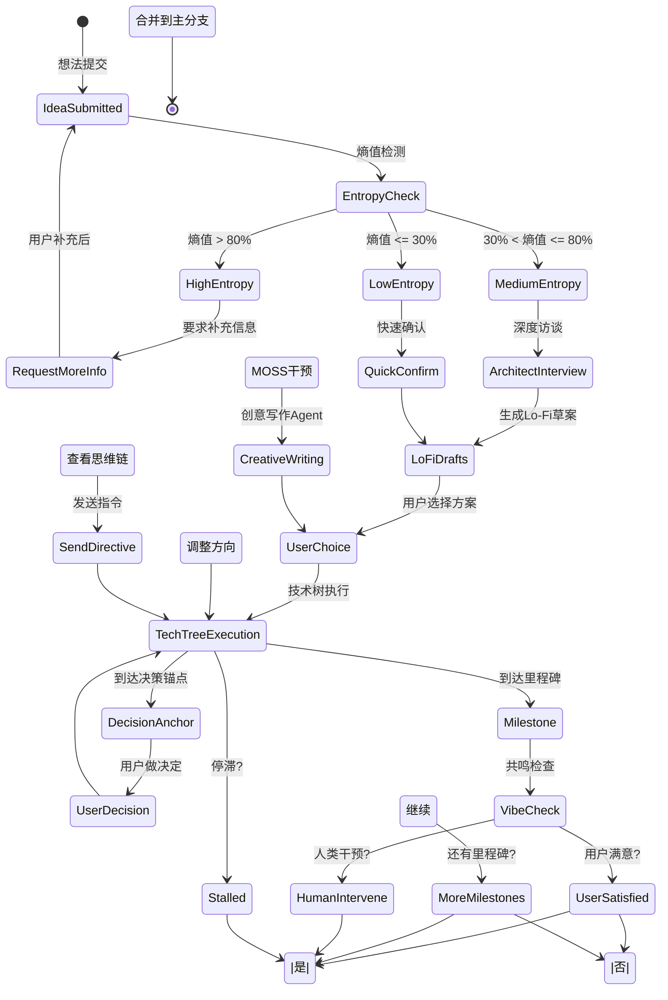

# 枇杷的挂机工坊 - 人类共鸣层设计

## 核心问题

如何用一个系统去构建系统本身，且保证在这个过程中，**人类的"灵魂"不会被机器的"平庸"所稀释**？

---

## 整体架构：启发式互动循环



---

## 1. 首席架构师 (Architect Agent)

### 1.1 核心定位

从"接单"到"访谈"——**对齐意图**是它的唯一KPI。

**视觉表现**（在工厂平面图中）：
- 位置：孵化区和工位之间的「会客厅」
- 形象：戴着单片眼镜、手持拐杖的绅士
- 环境：温暖的书房，墙上挂满了项目蓝图
- 状态：「思考中」、「访谈中」、「等待人类回复」

### 1.2 访谈模式 (The Interview)

当你丢入"建立枇杷的挂机工坊"这个想法时，Architect 不会开工，而是弹出对话框：

```
┌─────────────────────────────────────────────────────────────┐
│  🏛️ 首席架构师 - 项目对齐访谈                                  │
├─────────────────────────────────────────────────────────────┤
│                                                             │
│  「我感知到了这个项目的宏大。在派遣工人之前，我们需要确认     │
│   几个关键分歧点……」                                           │
│                                                             │
│  📋 问题 1/5：项目定位                                        │
│  ────────────────────────────────────────────────────────     │
│  你想要的是：                                                 │
│                                                             │
│  ○ A) 一个酷炫的演示原型（MVP，2周完成）                     │
│     重点：可视化效果、游戏化体验、概念验证                     │
│                                                             │
│  ○ B) 一个可用的开发工具（生产级，2个月完成）                 │
│     重点：稳定性、可扩展性、完善的文档                         │
│                                                             │
│  ○ C) 一个长期研究项目（探索未知，持续迭代）                   │
│     重点：实验性、前沿探索、快速迭代                           │
│                                                             │
│  ────────────────────────────────────────────────────────     │
│  [你的想法描述熵值: 72% 🟡] （有些模糊，但可以继续）          │
│                                                             │
│  [上一步]  [跳过访谈]  [暂存想法]                            │
└─────────────────────────────────────────────────────────────┘
```

### 1.3 访谈问题库

Architect 会根据想法的**熵值（模糊度）**动态调整问题：

| 熵值范围 | 问题数量 | 问题深度 |
|---------|---------|---------|
| 0-30% | 2-3 | 简单确认 |
| 30-60% | 4-6 | 中等深度 |
| 60-80% | 6-8 | 深度访谈 |
| 80-100% | 8-10 | 拒绝下发，要求补充 |

**标准访谈问题**：
1. 项目定位（MVP/生产级/研究）
2. 时间预期
3. 技术偏好
4. 成功标准
5. 风险承受度
6. 人机协作模式（全自动/半自动/全手动）

### 1.4 低保真草案 (Lo-Fi Drafts)

在写代码之前，Architect 必须先给出几种"技术路线"或"产品愿景"的简稿。

**示例：「建立枇杷的挂机工坊」的 Lo-Fi 草案**

```
┌─────────────────────────────────────────────────────────────┐
│  📐 技术路线概念草图 - 请选择                                 │
├─────────────────────────────────────────────────────────────┤
│                                                             │
│  方案 A：精简先锋派 (Lean & Mean)                             │
│  ────────────────────────────────────────────────────────     │
│  ╔═══════════════════════════════════════════════════╗     │
│  ║ 前端: Streamlit + Matplotlib 可视化                ║     │
│  ║ 后端: FastAPI + SQLite 单文件                       ║     │
│  ║ Agent: LangChain + GPT-4 简化版                    ║     │
│  ║ 记忆: ChromaDB 本地                                 ║     │
│  ╚═══════════════════════════════════════════════════╝     │
│                                                             │
│  ✅ 优点: 1周可跑、部署简单、改动灵活                       │
│  ⚠️ 缺点: 扩展性有限、可视化不够炫                           │
│  💰 成本: 低                                                │
│                                                             │
│  ○ 选择此方案                                               │
│                                                             │
│  方案 B：视觉盛宴派 (Visual Feast)                          │
│  ────────────────────────────────────────────────────────     │
│  ╔═══════════════════════════════════════════════════╗     │
│  ║ 前端: React + PixiJS + Framer Motion              ║     │
│  ║ 后端: FastAPI + PostgreSQL + Redis                ║     │
│  ║ Agent: LangGraph + 多模型路由                      ║     │
│  ║ 记忆: 三层存储 + Pinecone                          ║     │
│  ╚═══════════════════════════════════════════════════╝     │
│                                                             │
│  ✅ 优点: 效果炸裂、可扩展、生产就绪                         │
│  ⚠️ 缺点: 2个月开发、复杂度高                               │
│  💰 成本: 中高                                              │
│                                                             │
│  ○ 选择此方案                                               │
│                                                             │
│  方案 C：混合进化论 (Hybrid Evolution)                        │
│  ────────────────────────────────────────────────────────     │
│  先做方案A验证概念，成功后进化到方案B                         │
│  - Phase 1: 方案A (1周)                                    │
│  - Phase 2: 用户反馈迭代 (1周)                             │
│  - Phase 3: 迁移到方案B (1个月)                            │
│                                                             │
│  ✅ 优点: 灵活、低风险、可演化                               │
│  ⚠️ 缺点: 需要重写部分代码                                   │
│  💰 成本: 中等                                              │
│                                                             │
│  ◉ 选择此方案 (推荐)                                         │
│                                                             │
│  ────────────────────────────────────────────────────────     │
│  [返回访谈]  [生成对比报告]  [确认选择]                      │
└─────────────────────────────────────────────────────────────┘
```

### 1.5 拒绝认领权

如果 Architect 认为你的想法描述模糊度过高，它会拒绝将任务下发：

```
┌─────────────────────────────────────────────────────────────┐
│  ⚠️  想法熵值过高 - 任务暂不下发                               │
├─────────────────────────────────────────────────────────────┤
│                                                             │
│  当前想法熵值: 94% 🔴                                        │
│                                                             │
│  问题诊断：                                                  │
│  1. ❌ 缺少明确的目标用户                                    │
│  2. ❌ 没有成功标准定义                                       │
│  3. ❌ 技术约束不明确                                         │
│  4. ⚠️  "做一个好东西"过于模糊                                │
│                                                             │
│  建议补充：                                                  │
│  - 这个东西是给谁用的？                                       │
│  - 怎么才算"做好了"？                                        │
│  - 有时间/预算限制吗？                                       │
│  - 有参考的类似产品吗？                                      │
│                                                             │
│  [补充信息]  [暂存想法]  [强制启动(不推荐)]                   │
└─────────────────────────────────────────────────────────────┘
```

---

## 2. 技术树机制 (The Tech Tree)

### 2.1 核心概念

不要让项目像一条直线一样跑到底，而是把它变成一棵**可交互的技术树**。

**视觉表现**：
- 类似《文明》或《异星工厂》的科技树
- 每个节点代表一个决策点或里程碑
- 已完成的节点亮起来，带特效
- 可点击任何节点查看详情或回溯
- 虚线表示可选路径，实线表示已选路径

### 2.2 决策锚点 (Decision Anchors)

流程图上出现闪烁的问号，触发 WorkflowTransition 中的待定状态。



**决策锚点的触发时机**：
- 技术方案选择
- 架构设计决策
- 第三方库选型
- 用户体验方向
- 功能范围划定

### 2.3 多方案并行 (Multi-Track)

同时生成两个分支，例如"轻量版"和"全功能版"。

**工厂平面图中的表现**：
- 工位分裂成两条平行的生产线
- 每条线有自己的 Agent 团队
- 中间有一个"对比看板"实时对比两个方案的进度

**技术实现**：
```python
# idea_pool/core/multi_track.py
from typing import List, Dict
from uuid import UUID
from dataclasses import dataclass

from ..models.schemas import IdeaSchema, TaskSchema


@dataclass
class Track:
    """并行分支"""
    track_id: UUID
    name: str
    description: str
    idea: IdeaSchema
    tasks: List[TaskSchema]
    active: bool = True


class MultiTrackOrchestrator:
    """多分支编排器"""

    async def create_tracks(self, idea: IdeaSchema,
                            track_definitions: List[Dict]) -> List[Track]:
        """创建多个并行分支"""
        tracks = []
        for i, track_def in enumerate(track_definitions):
            # 为每个分支创建独立的 Idea 副本
            track_idea = idea.model_copy(
                update={
                    "id": uuid4(),
                    "title": f"{idea.title} [{track_def['name']}]",
                    "parent_idea_id": idea.id,
                    "metadata": {"track": track_def['name']}
                }
            )
            tracks.append(Track(
                track_id=track_idea.id,
                name=track_def['name'],
                description=track_def['description'],
                idea=track_idea,
                tasks=[]
            ))
        return tracks

    async def compare_tracks(self, tracks: List[Track]) -> Dict:
        """对比多个分支的进展"""
        return {
            "comparison": await self._generate_comparison_report(tracks),
            "recommendation": await self._recommend_track(tracks),
            "pros_cons": {t.name: self._get_pros_cons(t) for t in tracks}
        }
```

### 2.4 一键回溯 (Undo/Rollback)

发现方向错了，点击树节点，所有后续 Agent 停工并回收资源。

**回溯流程**：
```
1. 用户点击技术树的某个节点
2. 系统显示：「确定要回溯到这个点吗？」
3. 确认后：
   - 暂停所有在该节点之后的任务
   - 回收预算（未使用的部分）
   - Git 回退到该节点的 commit
   - 记忆回退到该节点的状态
4. 显示：「已回溯，你可以选择新的方向」
```

---

## 3. 共鸣检查协议 (The Vibe Check)

### 3.1 核心理念

在 Reviewer 检查代码逻辑之前，先检查**「人类是否满意这个方向」**。

### 3.2 阶段性汇报 (The Daily Standup)

就像游戏里的 NPC 汇报工作一样，Agent 在特定里程碑推送「明信片」。

**触发时机**：
- 完成 RESEARCH 进入 DESIGN
- 完成 DESIGN 进入 DEVELOPMENT
- 开发完成 50%
- 首次可运行版本
- 发现重大技术问题

**明信片样式**：

```
┌─────────────────────────────────────────────────────────────┐
│  📮 阶段性汇报 - 来自 Researcher-Alex                         │
│  项目: 「建立枇杷的挂机工坊」                                      │
│  时间: 2026-03-22 14:32                                      │
├─────────────────────────────────────────────────────────────┤
│                                                             │
│  「老板，我完成了初步研究。我有一些发现想跟你说……」             │
│                                                             │
│  📊 研究总结:                                                │
│  ✅ 找到了 12 个相关开源项目                                 │
│  ✅ 分析了 AutoGPT、MetaGPT、LangChain 的架构                 │
│  ⚠️  发现当前的向量数据库方案可能无法支撑你想要的"长期记忆"深度   │
│                                                             │
│  💡 我的建议:                                                 │
│  换用分层存储架构：                                           │
│  - 热记忆：Redis (最近7天)                                   │
│  - 温记忆：PostgreSQL JSONB (最近30天)                       │
│  - 冷记忆：ChromaDB (全部历史)                               │
│                                                             │
│  📎 附件: 完整研究报告 (PDF)                                  │
│                                                             │
│  ────────────────────────────────────────────────────────     │
│                                                             │
│  你觉得呢？                                                   │
│                                                             │
│  [👍 这个方向不错，继续]                                      │
│  [🤔 等等，我有别的想法] → (弹出对话框)                       │
│  [👀 让我看看你的思维链]                                      │
│  [⏸️  先暂停，我想想]                                        │
└─────────────────────────────────────────────────────────────┘
```

### 3.3 可视化工作流监控

你可以随时点击任何一个正在工作的 Agent，直接进入它的**「思维链」**。

**思维链查看器**：

```
┌─────────────────────────────────────────────────────────────┐
│  🧠 Developer-Bob 的思维链 - 实时监控                          │
│  项目: 「建立枇杷的挂机工坊」 - 核心编排器                          │
├─────────────────────────────────────────────────────────────┤
│                                                             │
│  [14:32:15] 好的，让我开始写编排器……                         │
│  [14:32:18] 首先，我需要定义 Orchestrator 类的核心接口……       │
│  [14:32:22] 等等，用户想要游戏化界面，我应该考虑 WebSocket……     │
│  [14:32:28] 让我先看看研究报告里的架构建议……                   │
│  [14:32:35] Researcher 建议用分层存储，但我觉得先从简单开始……   │
│  [14:32:42] 决定了，先用 SQLite + Redis，以后再扩展……           │
│  [14:32:50] 现在开始写代码……                                  │
│                                                             │
│  ────────────────────────────────────────────────────────     │
│                                                             │
│  💬 直接干预:                                                 │
│  [输入你的指令……]                                             │
│                                                             │
│  例如: "别管那个 API 了，先搞定 UI 逻辑"                      │
│                                                             │
│  [发送指令]  [离开思维链]                                     │
└─────────────────────────────────────────────────────────────┘
```

**人类干预的处理**：
- 当你在思维链中发送指令时，Agent 会：
  1. 立即暂停当前工作
  2. 确认理解你的指令
  3. 调整方向
  4. 继续工作（记录这次干预到记忆）

---

## 4. 针对「建立枇杷的挂机工坊」项目的具体拆解

### 4.1 Moss 的驱动流程

如果你把这个项目丢进池子，Moss 会这样驱动它：



### 4.2 众筹灵感阶段

Researcher Agent 不会闷头研究，它会先去搜索全球类似的开源项目：

```
📊 研究报告 - 类Agent开发框架对比
生成时间: 2026-03-22 15:00

┌────────────┬────────┬────────┬────────┬────────┐
│ 项目        │ 语言    │ 架构    │ 优势    │ 劣势    │
├────────────┼────────┼────────┼────────┼────────┤
│ AutoGPT    │ Python │ 单Agent│ 概念先驱 │ 易失控  │
│ MetaGPT    │ Python │ 多角色  │ 结构化  │ 太死板  │
│ LangChain  │ Python │ 工具库  │ 灵活    │ 太底层  │
│ AutoGen    │ Python │ 多Agent │ 微软支持│ 复杂    │
└────────────┴────────┴────────┴────────┴────────┘

💡 我们的差异化:
- 游戏化可视化界面（别人没有！）
- 人类共鸣层（避免猛干）
- 长期记忆系统（真正的进化）
- Notion 深度集成（外部大脑）

📎 详细分析见 Notion 页面...
```

### 4.3 增量构建策略

系统不会一下子写完所有代码，而是先给你一个能跑的框架雏形：

**Phase 1 交付物（第1周末）**：
```
✅ FastAPI 后端骨架
✅ 最简单的想法提交 API
✅ 基础的 SQLite 数据库
✅ Streamlit 前端（能看到想法列表）
✅ 单个 Researcher Agent（能做简单调研）
❌ 没有游戏化可视化
❌ 没有多 Agent 协作
❌ 没有记忆系统
```

**为什么这样？**
- 让你第1周就能在浏览器里点一点
- 快速验证概念
- 早期收集反馈
- 降低风险

---

## 5. Moss 的干预逻辑升级

### 5.1 需求不明确检测

如果检测到你在某个方案上徘徊了很久没点确认，Moss 会认为这是"需求不明确"。

**Moss 的应对策略**：

```
[MOSS 广播 · 电子音]
15:42:33 🟠 检测到人类在方案选择上已徘徊 27 分钟
15:42:33 🟠 推测：需求不明确，启动 Creative-Writing Agent
15:42:35 🟢 Creative-Writing Agent 已启动，正在生成产品故事...
```

**Creative-Writing Agent 生成的三个产品故事**：

```
📖 产品故事 A：「孤独的发明家」
───────────────────────────────
你是一个独立开发者，有无数想法但没时间实现。
每天晚上，你把想法丢进枇杷的挂机工坊，然后去睡觉。
第二天早上，世界大树上结出了新的果实——是你昨晚想法的原型。
你不需要懂所有技术，只需要有想法。

视觉风格：温暖、梦幻、童话感


📖 产品故事 B：「数字工厂厂长」
───────────────────────────────
你是一个工厂的厂长，管理着一群 AI 工人。
你在看板上把想法变成任务，观察工人们工作。
有时你需要调整方向，有时你需要仲裁分歧。
看着工厂从无到有，生产线越来越高效。

视觉风格：工业风、齿轮、传送带、工厂平面图


📖 产品故事 C：「AI 研究实验室」
───────────────────────────────
你是一个研究员，探索 AI 能做什么的边界。
每个想法都是一次实验，成功或失败都是数据。
你记录每次实验的结果，积累知识。
实验室里的每个仪器都代表一个 Agent。

视觉风格：科技感、实验室、数据面板、全息投影


你更认同哪个故事？这将决定我们的产品方向和视觉风格。

[故事 A] [故事 B] [故事 C] [都不太行，再帮我想两个]
```

---

## 6. 人类共鸣层的状态机



---

## 7. 总结

这个「人类共鸣层」的核心是：

1. **打破全自动的幻觉**：承认 AI 还不能完全理解人类的意图
2. **在关键节点停下来**：访谈、Lo-Fi 草案、决策锚点、共鸣检查
3. **给人类控制权**：回溯、干预、调整方向
4. **用游戏化缓解焦虑**：明信片、思维链查看器、技术树

正如 Gemini 所说，这是**「启发式互动循环」**——不是 AI 猛干，而是人机共舞。
