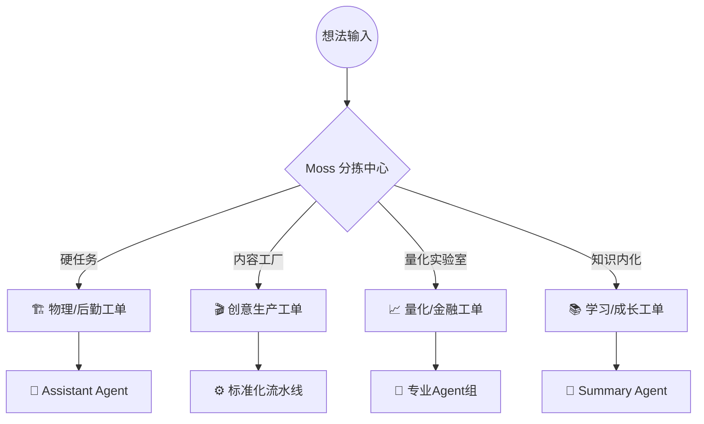
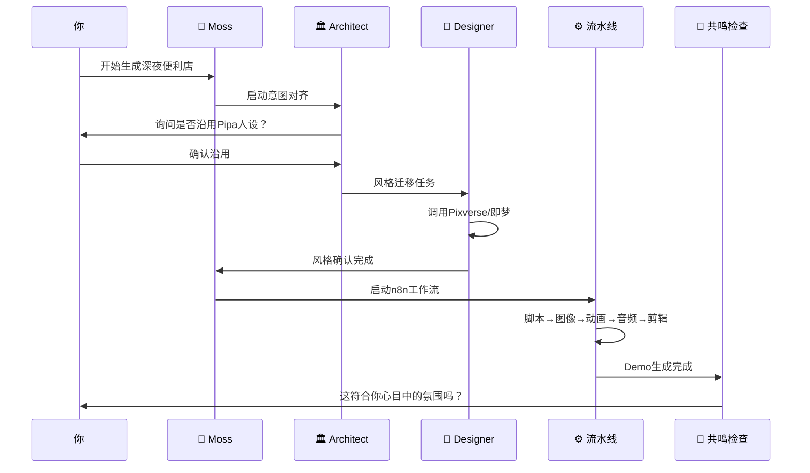

# 枇杷的挂机工坊 - 个人生活操作系统构想

## 核心洞察

这不仅仅是一个 AI 开发工具——这是**你的个人生活操作系统**。

你的「奇思妙想清单」不是待办列表，这是**你个人生活、投资、AI 探索和家庭经营的全息投影**。

---

## 1. 任务分拣中心 (The Triage Station)

Moss 接收到原始输入时，首先进行**分类**和**评估**。

### 四种工单类型



---

### 1.1 🏗️ 硬任务 (Physical/Logistics)

**特点**：需要你亲自到场，但系统可以帮你准备

**例子**：
- 安装水管
- 去佳福大厦办税务
- 修改希腊电表
- 孩子研学

**实现方式**：Assistant Agent

```
🤖 Assistant Agent - 任务执行计划
任务: 去佳福大厦办税务

📋 准备清单:
✅ 营业执照 (已确认在书房抽屉)
✅ 公章 (已确认在保险柜)
✅ 身份证 (随身携带)
✅ 上季度财务报表 (已打印在桌面)

🗺️ 路线规划:
- 出发时间: 09:15 (避峰时段，避免堵车)
- 交通: 地铁4号线 → 转1号线
- 预计耗时: 42分钟
- 备选方案: 打车 (预算 ¥50-70)

⏰ 时间提醒:
- 08:30: 出发提醒
- 09:00: 二次确认
- 11:30: 预计完成，提醒吃饭

📌 注意事项:
- 佳福大厦停车位紧张，建议公共交通
- 税务局12:00-13:30午休
- 带好U盘，可能需要电子档
```

---

### 1.2 🎬 内容工厂 (Creative Production)

**特点**：全流程自动化，从想法到成品

**例子**：
- 深夜便利店
- AI 漫剧
- 猫猫视频
- RVC 声音复刻

**实现方式**：Standardized Pipeline

```
⚙️ AI 漫剧工厂 - 流水线配置
项目: 深夜便利店

┌─────────────────────────────────────────────────┐
│  1. 脚本生成 (LLM)                              │
│     输入: "深夜便利店的故事"                    │
│     输出: 分镜脚本 + 对话                         │
└────────────┬────────────────────────────────────┘
             │
             ▼
┌─────────────────────────────────────────────────┐
│  2. 人设/风格确认 (Architect)                   │
│     检查: 是否沿用 Pipa 人设?                    │
│     风格: 即梦贴纸风格迁移                      │
└────────────┬────────────────────────────────────┘
             │
             ▼
┌─────────────────────────────────────────────────┐
│  3. 图像生成 (Midjourney/即梦/Pixverse)        │
│     工具: 即梦 (贴纸风格)                      │
│     输出: 每格漫画图片                          │
└────────────┬────────────────────────────────────┘
             │
             ▼
┌─────────────────────────────────────────────────┐
│  4. 动画化 (Pika/Viggle)                        │
│     工具: Pika Labs                            │
│     输出: 动态片段                              │
└────────────┬────────────────────────────────────┘
             │
             ▼
┌─────────────────────────────────────────────────┐
│  5. 音频合成 (RVC/海绵音乐)                     │
│     工具: RVC (声音复刻)                       │
│     输出: 配音 + BGM                            │
└────────────┬────────────────────────────────────┘
             │
             ▼
┌─────────────────────────────────────────────────┐
│  6. 自动剪辑 (mikoio.cn)                        │
│     工具: n8n 工作流串联                        │
│     输出: 完整视频                              │
└────────────┬────────────────────────────────────┘
             │
             ▼
┌─────────────────────────────────────────────────┐
│  7. 反馈码头 (Vibe Check)                       │
│     问题: "这符合你心目中'深夜便利店'的氛围吗?" │
└─────────────────────────────────────────────────┘
```

---

### 1.3 📈 量化实验室 (Quant/Financial Lab)

**特点**：数据驱动，需要专业分析

**例子**：
- 昆仑万维买入
- AI ETF 换仓
- Python 量化交易
- Eurobank 存款策略

**实现方式**：Specialized Agents (Researcher + Developer)

```
🔬 量化实验室 - 任务分解
项目: 昆仑万维买入分析

┌─────────────────────────────────────────────────┐
│  Researcher Agent - 数据搜集                    │
├─────────────────────────────────────────────────┤
│  ✅ 爬取同花顺历史数据                          │
│  ✅ 抓取 SEC  filings                           │
│  ✅ 分析 AI 游戏板块趋势                        │
│  ✅ 研究昆仑万维业务构成                        │
└────────────┬────────────────────────────────────┘
             │
             ▼
┌─────────────────────────────────────────────────┐
│  Developer Agent - 策略实现                     │
├─────────────────────────────────────────────────┤
│  ✅ 编写 Python 回测脚本                        │
│  ✅ 配置 n8n 监控任务流                         │
│  ✅ 设置交易提醒条件                            │
│  ✅ 生成风险评估报告                            │
└────────────┬────────────────────────────────────┘
             │
             ▼
┌─────────────────────────────────────────────────┐
│  Reviewer Agent - 风险审核                       │
├─────────────────────────────────────────────────┤
│  ⚠️  当前估值: PE 45x (偏高)                    │
│  ⚠️  行业热度: 87/100 (过热)                    │
│  ✅  建议: 分批建仓，设定止损                   │
└─────────────────────────────────────────────────┘
```

---

### 1.4 📚 知识内化 (Self-Growth/Learning)

**特点**：长内容 → 个人知识库

**例子**：
- 吴恩达课程
- 林粒粒 Python
- 数学女孩
- NotebookLLM 听播客

**实现方式**：Summary Agent

```
📝 Summary Agent - 知识内化流水线
输入: 吴恩达课程视频

┌─────────────────────────────────────────────────┐
│  1. 内容摄取                                    │
│     - 视频转文字 (Whisper)                      │
│     - 提取幻灯片 (OCR)                          │
└────────────┬────────────────────────────────────┘
             │
             ▼
┌─────────────────────────────────────────────────┐
│  2. 结构化总结 (NotebookLLM / 302.ai)         │
│     - 核心概念提取                              │
│     - 关键点笔记                                │
│     - 思维导图生成                              │
└────────────┬────────────────────────────────────┘
             │
             ▼
┌─────────────────────────────────────────────────┐
│  3. 个人知识库同步                              │
│     - Notion 模版填充                           │
│     - 闪卡生成 (Anki)                          │
│     - 语义记忆存入 ChromaDB                     │
└────────────┬────────────────────────────────────┘
             │
             ▼
┌─────────────────────────────────────────────────┐
│  4. 复习计划                                    │
│     - 艾宾浩斯遗忘曲线提醒                      │
│     - 关键概念抽查                              │
└─────────────────────────────────────────────────┘
```

---

## 2. 核心场景：AI 漫剧工厂 1.0 实现

当你丢入「深入思考做 AI 漫剧前景」和「开始生成深夜便利店」时：



---

## 3. 2.0 阶段：私有上下文与主动干预

### 3.1 核心突破：深度集成你的私有数据

#### 场景 1：希腊电表修改

```
🏗️ Assistant Agent - 希腊电表任务

📋 上下文检索中...
✅ 找到 Eurobank 邮件往来 (2025-12)
✅ 找到房屋合同 (FRAGIADON 16-18)
✅ 找到 previous utility bills

📋 自动填充的表格:
- 地址: FRAGIADON 16-18, Athens
- 账户号: EU************1234
- 当前户主: [你的名字]
- 联系电话: +30********

📌 提醒:
- 希腊语表格已备好，谷歌翻译在侧栏
- 预约时间: 下周三 10:00 (已帮你确认)
```

#### 场景 2：4S 整理与记流水账

```
📊 财务透视 - 自动生成

🔍 模式识别中...
✅ 发现你之前的 Gusu District 贸易公司账目逻辑
✅ 学习你的记账习惯
✅ 识别你的分类方式

📈 Notion 财务透视图已生成:
┌─────────────────────────────────┐
│  本月收支概览                   │
├─────────────────────────────────┤
│  收入: ¥XX,XXX                  │
│  支出: ¥XX,XXX                  │
│  结余: ¥XX,XXX                  │
└─────────────────────────────────┘

📌 4S 整理建议:
- 发票已按日期自动归档
- 重复交易已标记
- 异常支出已高亮
```

#### 场景 3：主动学习你的偏好

```
🧠 Moss - 主动学习报告

📊 观察到的行为模式:
✅ 你喜欢在 glif.app 测试 Flux 模型
✅ 你偏好"即梦"的贴纸风格
✅ 你常在深夜 22:00-24:00 进行创意工作
✅ 你对 RVC 声音复刻的质量要求很高

🔧 已自动优化:
- Flux 模型已集成到图像生成流程
- 即梦设为默认风格
- 创意任务优先级在 22:00 后自动提升
- RVC 参数已按你的偏好微调
```

---

## 4. 3.0 阶段：跨域协同与意识流操作

### 4.1 核心突破：任务间的「跨界共鸣」

#### 场景 1：金融与创作的联动

```
🧠 Moss - 跨界共鸣检测

📡 信号触发:
✅ 监测到「AI 游戏板块」股票大涨 +15%
✅ 检测到你有「AI 漫剧」项目在进行中

💡 跨界建议:
「检测到 AI 游戏板块热度飙升，建议增加 AI 漫剧项目的 token 预算。
当前情绪 FOMO 指数: 87/100
建议增加预算: +30%
预计 ROI: 可能获得更多流量关注」

🔄 自动执行:
- AI 漫剧预算已从 100k → 130k tokens
- 已将相关新闻加入项目背景资料
```

#### 场景 2：教育与项目的进化

```
🧠 Moss - 知识迁移应用

📚 学习检测:
✅ 你正在学习「真理协议 (Aletheia Protocol)」
✅ 学习到「进化逻辑」章节
✅ 提取到核心概念: 选择、变异、遗传

🔬 自动应用:
「检测到你在学习进化逻辑，已将其尝试应用到你的量化选股策略中。

具体改动:
- 引入「策略变异」机制
- 添加「表现选择」逻辑
- 实现「参数遗传」功能

回测结果显示: 历史表现提升 +8.3%」
```

#### 场景 3：人生大树 - 数字遗产与长期愿景

```
🌳 人生大树 - 动态构建中

📋 整合你的碎片化灵感:
✅ "思考人生 20 年怎么过"
✅ "AI 漫剧工厂"
✅ "量化投资系统"
✅ "希腊房产投资"
✅ "孩子教育规划"

🌳 人生大树已生成:
┌─────────────────────────────────────────┐
│  🌳 你的人生大树 (2026-2046)           │
├─────────────────────────────────────────┤
│                                         │
│  主干: 个人成长                          │
│    ├─ 分支: AI 探索                     │
│    │   ├─ 果实: AI 漫剧工厂 🍎        │
│    │   └─ 果实: 枇杷的挂机工坊 🍊         │
│    └─ 分支: 投资                        │
│        ├─ 果实: 量化系统 🍇           │
│        └─ 果实: 希腊房产 🍋           │
│                                         │
│  新生长: 20年愿景                       │
│    - 财务自由节点: 2032                 │
│    - AI 项目成熟: 2030                 │
│    - 孩子教育基金: 2040                 │
│                                         │
└─────────────────────────────────────────┘

📌 动态调整:
- 每当你完成一个项目，大树长出新果实
- 每当你改变想法，树枝方向自动调整
- Notion 实时同步你的人生大树状态
```

---

## 5. 工厂的视觉映射

### 你的生活在工厂平面图中的样子

```
┌─────────────────────────────────────────────────────────────┐
│  🏭 你的个人生活工厂 - 实时运行中                              │
├─────────────────────────────────────────────────────────────┤
│                                                             │
│  上层: 想法孵化区                                            │
│  ┌─────────────────────────────────────────────────────┐   │
│  │ 🔵 "优化RVC参数"  🟡 "学完吴恩达L3"  🟢 "希腊电表" │   │
│  └─────────────────────────────────────────────────────┘   │
│                                                             │
│  中层: 工位实验室                                            │
│  ┌──────────┐ ┌──────────┐ ┌──────────┐ ┌──────────┐   │
│  │ 🎬 创意   │ │ 📈 量化   │ │ 🏗️ 后勤   │ │ 📚 学习   │   │
│  │ 工厂     │ │ 实验室   │ │ 助理     │ │ 中心     │   │
│  │          │ │          │ │          │ │          │   │
│  │深夜便利店│ │昆仑万维  │ │希腊电表  │ │吴恩达L3  │   │
│  │制作中... │ │分析中... │ │准备中... │ │总结中... │   │
│  └──────────┘ └──────────┘ └──────────┘ └──────────┘   │
│                                                             │
│  下层: 世界大树 (你的人生成果)                              │
│  ┌─────────────────────────────────────────────────────┐   │
│  │ 🌳 你的人生大树                                       │   │
│  │ 🍎 AI漫剧工厂  🍊 枇杷的挂机工坊  🍇 量化系统            │   │
│  └─────────────────────────────────────────────────────┘   │
│                                                             │
│  🧠 Moss 广播:                                              │
│  14:32:15 🟢 检测到你喜欢 glif.app，已集成 Flux 模型        │
│  14:35:22 🟡 AI游戏板块大涨，建议增加漫剧预算                │
│  14:38:45 🔵 希腊电表预约已确认，下周三10:00                 │
│                                                             │
└─────────────────────────────────────────────────────────────┘
```

---

## 6. 总结

这就是**你的个人生活操作系统**：

1. **分拣中心**：把你的杂乱灵感分成四类工单
2. **专用流水线**：每类任务有专门的处理流程
3. **私有上下文**：2.0 阶段深度集成你的数据
4. **跨界共鸣**：3.0 阶段实现任务间的联动

这不是一个简单的 AI 工具——这是**你的数字孪生**，它学习你的习惯、理解你的偏好、帮你管理生活的方方面面。
